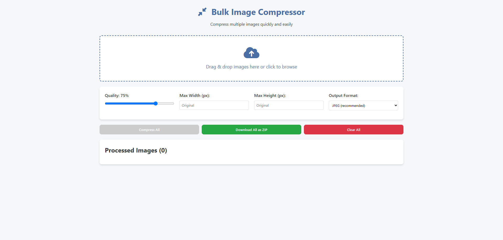

A lightweight web application for compressing multiple images at once with customizable settings. Works entirely in the browser – no server required!

---

## 🚀 Features

- **Bulk Processing**: Compress multiple images simultaneously
- **Adjustable Compression**:
  - Quality control (1–100%)
  - Max width/height constraints
  - Output format selection (JPEG, PNG, WebP)
- **Visual Comparison**: Before/after preview with file size savings
- **Download Options**:
  - Individual image downloads
  - Batch download as ZIP archive
- **Responsive Design**: Works on desktop and mobile devices
- **No Server Needed**: All processing happens in the browser

---

## 📖 How to Use

### 1. Upload Images
- Drag & drop files into the upload area
- Or click to browse your files

### 2. Adjust Settings (Optional)
- Set compression quality (75% recommended)
- Specify maximum dimensions
- Choose output format (WebP recommended for best compression)

### 3. Compress
- Click **"Compress All"** button
- View savings percentage for each image

### 4. Download
- Download individual images
- Or download all as a **ZIP archive**

---

## 🛠️ Technical Details

- **Frontend**: Pure HTML, CSS, and JavaScript
- **Libraries**:
  - [JSZip](https://stuk.github.io/jszip/) for ZIP archive creation
  - [Font Awesome](https://fontawesome.com/) for icons
- **Compression**: Uses the Canvas API for image manipulation

---

## 💻 Installation

No installation required! Just open `index.html` in any modern browser.

### For local development:

```bash
git clone https://github.com/yourusername/bulk-image-compressor.git
cd bulk-image-compressor
```
# Open index.html in your browser 
## 🌐 Browser Support

Fully supported in modern browsers:

- Chrome  
- Firefox  
- Safari  
- Edge  
- Mobile Safari / Chrome  

---

## ⚠️ Limitations

- Very large image collections may affect browser performance  
- Maximum image size is limited by device/browser memory  
- Some EXIF data (e.g. rotation, GPS) may not be preserved  

---

## 🤝 Contributing

Contributions are welcome!  
Please open an issue or pull request for any improvements or suggestions.

---

## 📄 License

**MIT License** – Free for personal and commercial use
